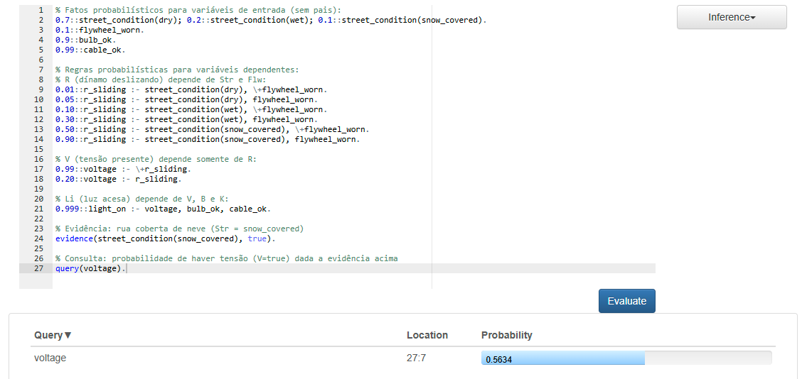

Aluna: Giulia Duarte - 22152030

Respostas dos itens (a), (b), (c), (d) e (e) da 1ª questão estão no PDF anexado.

2ª Questão (Implementação)

Para confirmar o resultado de forma computacional, podemos modelar a rede acima em linguagem **ProbLog**. A implementação consiste em definir fatos probabilísticos para as variáveis sem pais (`Str`, `Flw`, `B`, `K`) e regras probabilísticas para as dependências condicionais (`R`, `V`, `Li`). Abaixo está o código completo, baseado no exemplo do tutorial do ProbLog, incluindo comentários que explicam cada parte. Ao final, inserimos a evidência `Str = snow_covered` e realizamos uma consulta para calcular P(V = true | Str = snow_covered):

```prolog
% Fatos probabilísticos para variáveis de entrada (sem pais):
0.7::street_condition(dry); 0.2::street_condition(wet); 0.1::street_condition(snow_covered).
0.1::flywheel_worn.
0.9::bulb_ok.
0.99::cable_ok.

% Regras probabilísticas para variáveis dependentes:
% R (dínamo deslizando) depende de Str e Flw:
0.01::r_sliding :- street_condition(dry), \+flywheel_worn.
0.05::r_sliding :- street_condition(dry), flywheel_worn.
0.10::r_sliding :- street_condition(wet), \+flywheel_worn.
0.30::r_sliding :- street_condition(wet), flywheel_worn.
0.50::r_sliding :- street_condition(snow_covered), \+flywheel_worn.
0.90::r_sliding :- street_condition(snow_covered), flywheel_worn.

% V (tensão presente) depende somente de R:
0.99::voltage :- \+r_sliding.
0.20::voltage :- r_sliding.

% Li (luz acesa) depende de V, B e K:
0.999::light_on :- voltage, bulb_ok, cable_ok.

% Evidência: rua coberta de neve (Str = snow_covered)
evidence(street_condition(snow_covered), true).

% Consulta: probabilidade de haver tensão (V=true) dada a evidência acima
query(voltage).
```

Executando o programa ProbLog acima, a consulta query(voltage) retorna P(voltage = true | street_condition = snow_covered) ≈ 0.5634 (56,34%), em conformidade com o cálculo manual da questão 1(e).

Como executar o código: 

1. Acesse: https://dtai.cs.kuleuven.be/problog/editor.html
2. Apague o que estiver no editor e cole o código acima (ProbLog).
3. Clique no botão "Evaluate" (no topo).
4. O resultado da consulta (query(...)) aparecerá abaixo.


